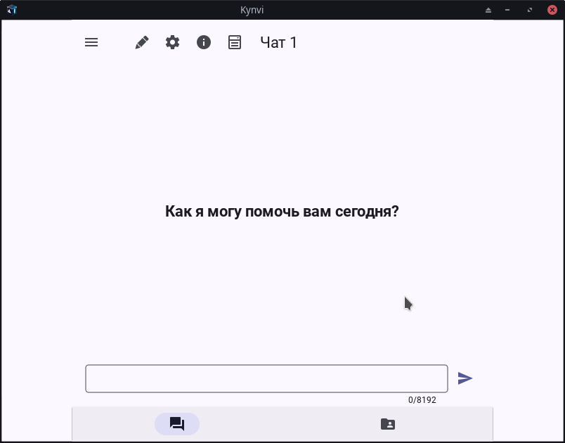

# Kynvi 

**RuStore**: [Kynvi on RuStore](https://www.rustore.ru/catalog/app/com.kynvi.kynvi)

## Features

- **Re-Button**: Double-click on a message to activate the Re-Button.
- **Message Selection**: Select multiple messages for removal.
- **Copying**: Long press (clamping) on a message to copy its content.



## Installation

To install Kynvi, ensure you have the following dependencies as listed in `requirements.txt`:

```text
python >= 3.8.0
kivymd >= 2.0.0
kivy >= 2.3.0
```

### Steps to Install

1. Clone the repository:
   ```bash
   git clone https://github.com/AHiXilTOr/kivy-chatgpt.git
   ```
2. Navigate to the project directory:
   ```bash
   cd kivy-chatgpt
   ```
3. Install the required packages:
   ```bash
   pip install -r requirements.txt
   ```

## Usage

To run the latest build of Kynvi, ensure you are on the `apk` branch and execute the application.

## License

This project is licensed under the GPL-3.0 License. See the [LICENSE](LICENSE) file for more details.

## Contact

For any questions or issues, please reach out to the project maintainers at [kynvi.staff@gmail.com](mailto:kynvi.staff@gmail.com).
